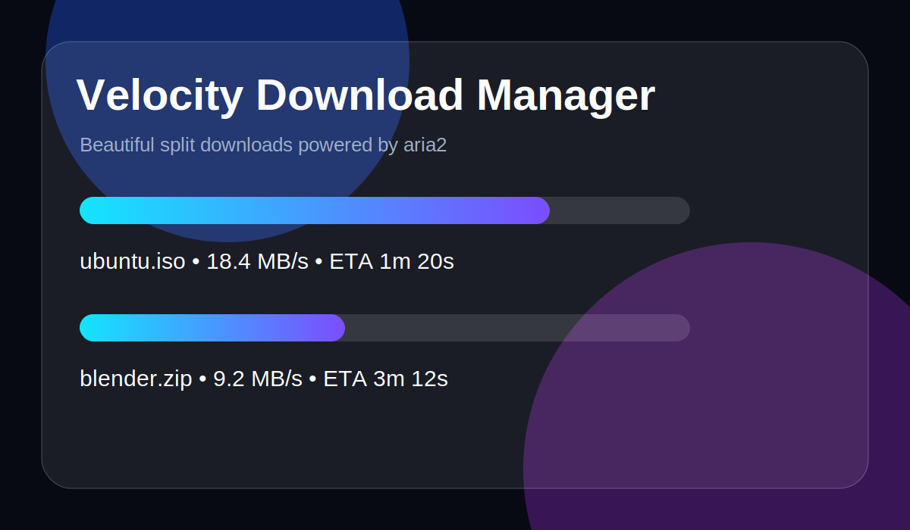

# Velocity Download Manager

Velocity is a beautiful animated **Linux-first** download manager built to chase fastest-class real-world download speed. It uses the proven **aria2** engine underneath, so downloads can be split into many parallel parts just like the fastest split-download managers.



## Why this project exists

Normal browser downloads are often single-stream and fragile. Velocity gives you a polished app UI while using aria2's fast engine for:

- segmented / split downloads
- resume support
- retry support
- queue management
- torrent, magnet and metalink capability through aria2
- Linux-first workflow; cross-platform can come later after the Linux product is excellent

## Current version

`v0.1.0` is a working MVP:

- Animated React desktop UI
- Electron desktop shell
- aria2 RPC engine auto-started by the app
- Add URL download
- Choose save folder
- Pause / resume / remove
- Live speed, progress, ETA and connection count
- Completed/stopped list
- Tests for core display logic
- Linux AppImage/deb build scripts
- Fastest Mode benchmark script

## Tech stack

- **Electron**: cross-platform desktop shell
- **React + TypeScript**: frontend UI
- **Framer Motion**: animations
- **aria2c**: high-speed segmented download engine
- **Vite**: frontend build tooling
- **Vitest**: tests

## Simple installation for users on Ubuntu/Linux

### 1. Install aria2

```bash
sudo apt update
sudo apt install -y aria2
```

Or from this repo:

```bash
scripts/install-linux-deps.sh
```

### 2. Download a release

From the GitHub Releases page, download either:

- `.AppImage` for portable launch
- `.deb` for Debian/Ubuntu installation

### 3A. Run AppImage

```bash
chmod +x "Velocity Download Manager-0.1.0.AppImage"
./"Velocity Download Manager-0.1.0.AppImage"
```

### 3B. Install deb

```bash
sudo apt install ./velocity-download-manager_0.1.0_amd64.deb
```

Then open **Velocity Download Manager** from your app launcher.

## Developer installation

```bash
git clone https://github.com/vimal-v-2006/velocity-download-manager.git
cd velocity-download-manager
npm install
npm run dev
```

## Benchmark Fastest Mode

```bash
scripts/benchmark-download.sh https://speed.hetzner.de/100MB.bin
```

See `docs/BENCHMARKING.md`. Until we run fair tests, the honest claim is **built to be the fastest Linux download manager**, not an unproven factual "fastest in the world" claim.

## Build locally

```bash
npm install
npm test
npm run build
npm run dist:linux
```

Build outputs appear in:

```text
release/
```

## How to use

1. Open Velocity.
2. Paste a direct HTTP/HTTPS URL, magnet link, torrent URL, or metalink URL.
3. Choose a save folder if you do not want the default `~/Downloads`.
4. Choose split count. `16` is fastest for many servers, but some servers limit connections.
5. Press **Start**.
6. Watch live speed, progress, ETA and connection count.
7. Pause/resume/remove from the download card.
8. Click **Open** to open the completed file path.

## Use cases

- Download Linux ISOs faster
- Download large software installers
- Resume unreliable network downloads
- Queue multiple files overnight
- Use aria2 torrent/magnet capability through a beautiful UI
- Linux desktop replacement for browser downloads

## How Velocity gets speed

Velocity does not invent fake speed. It delegates downloads to aria2, which can request different byte ranges of the same file at the same time.

Example:

```text
large.iso
├── part 1: 0% - 6.25%
├── part 2: 6.25% - 12.5%
├── ...
└── part 16: 93.75% - 100%
```

Those parts download in parallel and aria2 writes them into the final file. This can be much faster than one browser connection when the server and network allow it.

## Host compatibility profiles

Some hosts do not allow aggressive multi-connection TLS/range behavior. Velocity keeps Fastest Mode for normal direct links, but applies safer profiles for known strict hosts.

Current compatibility profile:

- **Pixeldrain**: uses a compatibility/fallback path because Pixeldrain can reject aria2 16-split TLS/range behavior. If any strict host fails with 16 splits, set the slider to **1 split** and retry.

This means Pixeldrain downloads should work reliably, but may not be as fast as hosts that allow 16 parallel segments.

## Important notes

- Some websites block segmented downloads. Reduce split count if a server rejects requests.
- Some links require browser cookies or special headers. Browser extension support is planned.
- aria2 must be installed and available as `aria2c`.
- Fastest real speed still depends on your network, server limits and disk speed.

## Project structure

```text
velocity-download-manager/
├── electron/
│   ├── main.cjs          # starts aria2 and exposes safe IPC commands
│   └── preload.cjs       # secure bridge for renderer
├── src/
│   ├── App.tsx           # animated UI
│   ├── styles.css        # glass/aurora design system
│   ├── lib/format.ts     # tested display helpers
│   └── types.ts          # aria2 data types
├── docs/
│   ├── INSTALLATION.md
│   ├── USER_MANUAL.md
│   └── PROJECT_EXPLANATION.md
└── package.json
```

## Roadmap

- Browser extension to catch downloads
- Per-download headers/cookies
- Speed limiter
- Schedule downloads
- Better torrent file picker
- Themes
- Auto-updater
- Native Tauri/Rust edition later if Linux v1 needs smaller binaries or a fully custom engine

## License

MIT
